# SENVORA Service Operations Agent

A Salesforce Agentforce service operations demo combining deterministic Apex actions, secure external REST integration, and controlled human escalation.

> This repository is a controlled technical demonstration by SENVORA Systems. It is not a production deployment, customer implementation, or production-ready support platform.

## Technical Overview

### Case Investigator

Retrieves Salesforce Case context through the deterministic `GetCaseContextAction` Apex action. The action supports Case Number and Case ID lookups, applies sharing rules and `WITH USER_MODE`, and returns structured results without fabricating data.

### External Incident Integration

Uses resolved Case context to look up a linked incident through `GetLinkedIncidentAction`, a Salesforce Named Credential, an External Credential, and HTTPS. The action returns structured found or not-found results that ground the Agentforce response.

The complementary [SENVORA Incident Demo API](https://github.com/senvorasystems/senvora-incident-api-demo) repository contains the Next.js and TypeScript REST API used to simulate the external incident system. It is a controlled demo service, not a production incident platform.

### Human Escalation

Routes a confirmed escalation from Agentforce through Omni-Channel to a human service representative. The agent explicitly requests user confirmation before initiating the handoff.

## Architecture

```mermaid
flowchart LR
    User --> Router[Agentforce Router]

    Router --> CaseInvestigator[Case Investigator]
    CaseInvestigator --> CaseAction[GetCaseContextAction]
    CaseAction --> CaseContext[Resolved Salesforce Case context]

    CaseInvestigator --> IncidentInvestigator[Incident Investigator]
    CaseContext -. caseId .-> IncidentInvestigator

    IncidentInvestigator --> IncidentAction[GetLinkedIncidentAction]
    IncidentAction --> NamedCredential[Named Credential]
    NamedCredential --> ExternalCredential[External Credential]
    ExternalCredential --> DemoAPI[SENVORA Incident Demo API]
    DemoAPI --> GroundedResponse[Grounded response]

    Router --> Escalation[Escalation]
    Escalation --> Confirmation[Explicit confirmation]
    Confirmation --> OmniChannel[Omni-Channel]
    OmniChannel --> Representative[Human representative]
```



## Current Status

### Case Investigator MVP ✅

- Agentforce routing to the Case Investigator
- Deterministic `GetCaseContextAction` Apex action
- Lookup by Case Number or Salesforce Case ID
- Least-privilege, read-only access using `WITH USER_MODE`
- Structured success and failure outcomes
- No-fabrication behavior for unsuccessful lookups

### External Integration MVP ✅

- Incident Investigator integrated with Case context
- Callout-enabled `GetLinkedIncidentAction` Apex action
- Named Credential `SENVORA_Incident_API` with External Credential authentication
- Ten-second timeout and batches of at most 50 unique accessible Case IDs
- Stable response order and duplicate-position preservation
- Sanitized validation, access, HTTP, and technical errors
- No exposure of remote response bodies, exception details, API keys, or secrets
- Real found and not-found callouts validated from Salesforce to the demo API
- End-to-end behavior validated in Agentforce Builder Preview and the active Enhanced Web Chat v2 deployment

Validated demo scenarios:

- Case `00001002` resolved to external incident `INC-2026-0001`, with status `Investigating`, severity `High`, and title `GC5060 electrical installation issue`.
- Case `00001003` returned `found=false`; Agentforce correctly reported that no linked incident exists without fabricating incident fields.

### Human Escalation MVP ✅

- Escalation routing with explicit user confirmation
- Native Agentforce `@utils.escalate`
- Omni-Channel routing to a Messaging Session queue
- Published Enhanced Web Chat v2 deployment
- Real two-way conversation after human handoff
- Regression-validated alongside the external integration

## What Is Included in Source

- `GetCaseContextAction`
- `GetCaseContextActionTest`
- `GetLinkedIncidentAction`
- `GetLinkedIncidentActionTest`
- Salesforce DX project configuration
- Salesforce Code Analyzer configuration

## Configured in Salesforce Org

The following components were configured and validated in the Salesforce org but are not currently versioned in this repository:

- Agentforce agent and subagents
- Agentforce routing
- Messaging configuration
- Enhanced Web Chat v2
- Omni-Channel
- Escalation flow
- Queues
- Permission assignments
- Named Credential
- External Credential

This is a reproducibility limitation of the portfolio. Authentication parameters, API keys, and External Credential secrets are deliberately stored outside source control and are not present in Git.

## Testing and Quality

Latest verified results:

- Combined Apex test execution: 30/30 passed, 0 failed
- `GetCaseContextAction`: approximately 95% coverage
- `GetLinkedIncidentAction`: 93.58% coverage
- Explicit 50+2 callout batching test
- `HttpCalloutMock` coverage for found, not-found, validation, HTTP, malformed, incomplete, and technical responses
- Salesforce Code Analyzer: 0 critical/high findings and no blocking security findings
- Remaining analyzer findings are maintainability and test-style observations documented during review

The Apex actions are read-only with respect to Case data. Tests create their own Salesforce records and do not depend on existing org business data.

## Security Design

- Apex contains no API keys, authentication parameters, or external service secrets.
- The external endpoint is referenced through the `SENVORA_Incident_API` Named Credential.
- API-key authentication is handled by Salesforce credential configuration outside Git.
- Case access is enforced with sharing and `WITH USER_MODE`.
- Remote response bodies and raw exception messages are not exposed to Agentforce outputs.
- Incomplete or ambiguous external payloads are treated as errors rather than fabricated not-found results.

## Current Limitations

- This is a controlled technical demo and is not production-ready.
- Some Agentforce, Messaging, Omni-Channel, permission, and credential metadata is configured in the org rather than versioned in this repository.
- The external incident service uses controlled demo fixtures and does not contain real customer incidents.
- Reproducing the complete end-to-end experience requires equivalent manual Salesforce org configuration.
- Production monitoring, governance, operational hardening, and broader deployment automation are outside the current scope.

## Project Structure

```text
force-app/main/default/classes/  Apex actions, tests, and metadata
config/                          Scratch org definition
code-analyzer.yml                Salesforce Code Analyzer configuration
sfdx-project.json                Salesforce DX project configuration
```

## Prerequisites

- Salesforce CLI
- A Salesforce development environment with Agentforce and Messaging capabilities appropriate to the demo
- Equivalent org-side Agentforce, routing, permission, credential, and Omni-Channel configuration
- Access to a deployed instance of the controlled SENVORA Incident Demo API

The source can be reviewed independently, while executing the Apex tests requires an authenticated Salesforce development environment. The complete conversational and escalation flows also depend on the org-configured components listed above.

## License

Licensed under the Apache License 2.0. See [LICENSE](LICENSE).
